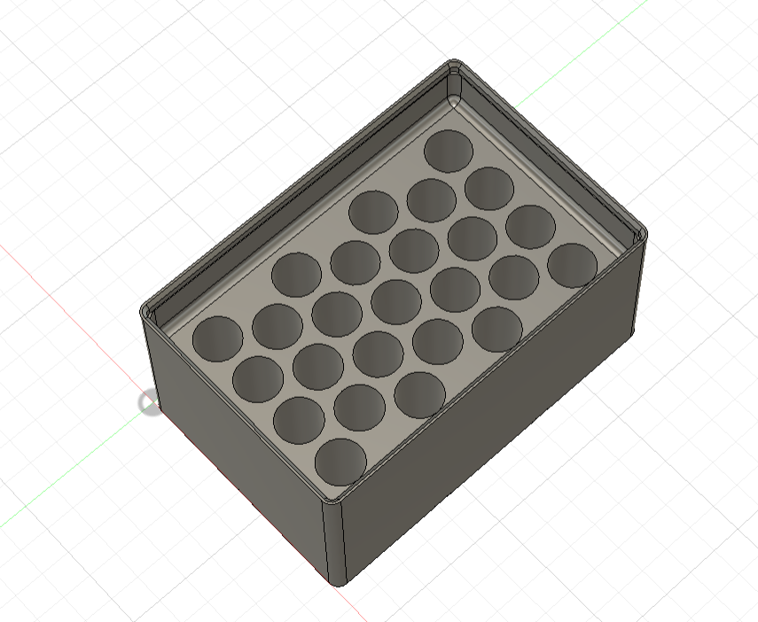
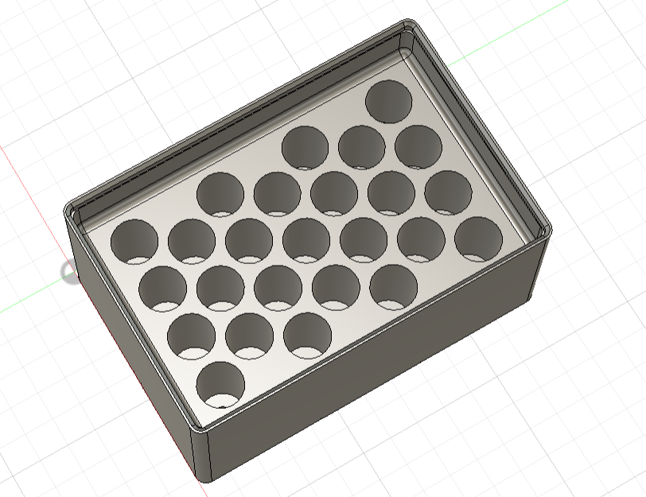

# GridfinityBatteryBinGenerator

A Fusion 360 add-in that generates parametric [Gridfinity](https://gridfinity.xyz/) battery
storage bins — pick a bin size and a battery type, and it builds the bin with the
maximum number of tip-down battery slots that fit.



Batteries store **tip down**. Every slot has a recess cut into its bottom so the
button (or a 9V's snap terminals) hangs free and the battery rests on its
shoulder — the weight never sits on the terminal. Slots are laid out to maximize
count: the generator tries a square grid and hex-offset packing in both
orientations and keeps whichever fits the most cells, centered in the bin.



## Features

- **One dialog** — battery type (AAA, AA, CR123, 9V) plus bin width × length in
  Gridfinity units. Everything else is prefilled and editable.
- **Real Gridfinity geometry** — base studs, walls, and stacking lip come from
  the [GridfinityGenerator](https://github.com/Le0Michine/FusionGridfinityGenerator)
  add-in's library (bundled), so bins are identical to that plugin's output and
  compatible with standard baseplates and stacking.
- **Maximized layouts** — hex-offset packing for round cells (a 2×3 bin holds
  41 AAA or 25 AA with defaults), rectangular grids for 9V with automatic
  90° rotation when that fits more.
- **Auto height** — computes the minimum number of 7 mm height units that keeps
  the slots and tip recesses inside the bin, so bins stay as short as possible.
- **Stackability check** — a live readout shows the vertical stack-up and warns
  if a stored battery would stand proud of the wall top and interfere with a
  bin stacked above.
- **Editable layout rules** — minimum slot-to-slot spacing (3 mm), slot-to-wall
  clearance (5 mm), and the fillet radius where the slot ledge meets the wall
  (3 mm) are all dialog inputs; tightening them squeezes in more batteries.
- **Standard bin options** — stacking lip, lip notches, magnet cutouts, and
  screw holes pass straight through to the underlying library.

## Install

**Manual (from this repo):** copy the `GridfinityBatteryBinGenerator` folder (the one
containing `GridfinityBatteryBinGenerator.py`) to Fusion's add-ins folder:

| OS | Path |
|---|---|
| Windows | `%APPDATA%\Autodesk\Autodesk Fusion 360\API\AddIns\` |
| macOS | `~/Library/Application Support/Autodesk/Autodesk Fusion 360/API/AddIns/` |

Then in Fusion: **Utilities → ADD-INS → Add-Ins tab**, select
*GridfinityBatteryBinGenerator*, check *Run on Startup*, click **Run**. A **Battery bin**
button appears under **Solid → Create**.

**MSI (Windows, all users):** grab the installer from
[Releases](../../releases). It installs the add-in machine-wide to
`C:\Program Files\Autodesk\ApplicationPlugins`, covering every user profile on
the computer. Don't combine it with a manual copy in `%APPDATA%` or the
command will appear twice.

## Usage

Pick a battery type — the slot dimensions, recess dimensions, ledge drop, and
battery length load from the defaults table below (all editable per run). Set
the bin footprint in Gridfinity units. The result box at the bottom shows the
battery count, the chosen layout, the vertical stack-up, and the stackability
margin before you commit. *Show preview* regenerates the model live as you
change inputs (slower on large bins); leave it off and just hit OK.

Default dimensions (mm), from a well-tested set of printed bins:

| | AAA | AA | CR123 | 9V |
|---|---|---|---|---|
| Slot Ø (or L×W) | 11 | 14.75 | 17 | 27.4 × 17.5 |
| Slot depth | 30 | 36 | 20 | 34 |
| Tip recess Ø (or L×W) | 4 | 6 | 7 | 14 × 8 |
| Tip recess depth | 2.5 | 2.5 | 2.5 | 4 |
| Ledge drop from wall top | 15 | 15 | 15 | 15 |
| Battery length (max nominal) | 44.5 | 50.5 | 34.5 | 48.5 |
| Auto height | 8 u | 9 u | 6 u | 9 u |

To change the defaults permanently, edit
`GridfinityBatteryBinGenerator/lib/batteryUtils/batteryDefs.py` — adding a new battery
type is a single new entry in the same table.

## How the layout works

The minimum pitch between slot centers is *slot diameter + spacing*. For round
cells, hex-offset rows sit √3/2 × pitch apart (alternate rows shifted half a
pitch), which packs meaningfully more cells than a square grid once the bin is
a few slots wide — every neighbor, including diagonals, stays exactly one pitch
apart, so the 3 mm minimum wall between slots holds everywhere. The generator
compares square, hex-along-X, and hex-along-Y and keeps the winner. The 5 mm
slot-to-wall clearance leaves room for the 3 mm fillet that strengthens the
junction between the slot ledge and the wall above it.

## Development

The layout math and dialog logic are plain Python with no Fusion dependency
and run anywhere:

```
python3 GridfinityBatteryBinGenerator/tests/test_layout.py      # packing + height math
python3 GridfinityBatteryBinGenerator/tests/test_entry_sim.py   # dialog logic against a stubbed Fusion API
```

`installer/` holds the Windows MSI sources (`make_wxs.py` regenerates the WiX
source from the tree; `build.ps1` documents the build) and the
`PackageContents.xml` used for the Autodesk App Store `.bundle` submission.

## License and credits

Licensed **CC BY-NC-SA 4.0** (free, non-commercial, share-alike) — see
[LICENSE](LICENSE).

- Gridfinity bin geometry: bundled from
  [FusionGridfinityGenerator](https://github.com/Le0Michine/FusionGridfinityGenerator)
  by **Lev Mishin**, CC BY-NC-SA 4.0 (see
  [ATTRIBUTION](GridfinityBatteryBinGenerator/ATTRIBUTION.md)).
- The [Gridfinity](https://gridfinity.xyz/) system is by **Zack Freedman**,
  CC BY-NC-SA 4.0.
- Battery slot layout engine and the Battery bin command are original to this
  project.

Not affiliated with Autodesk. Fusion and Fusion 360 are trademarks of Autodesk, Inc.
