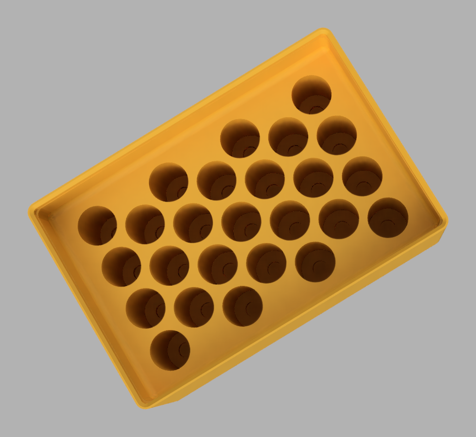
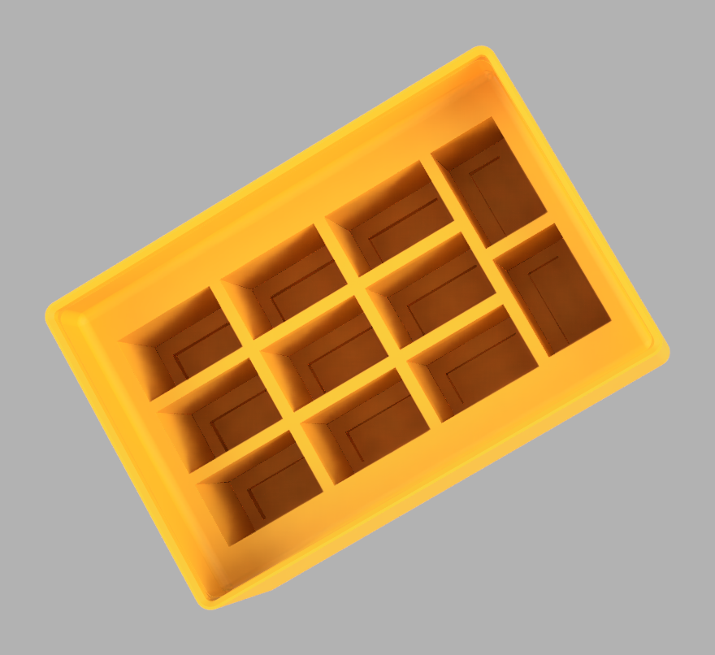
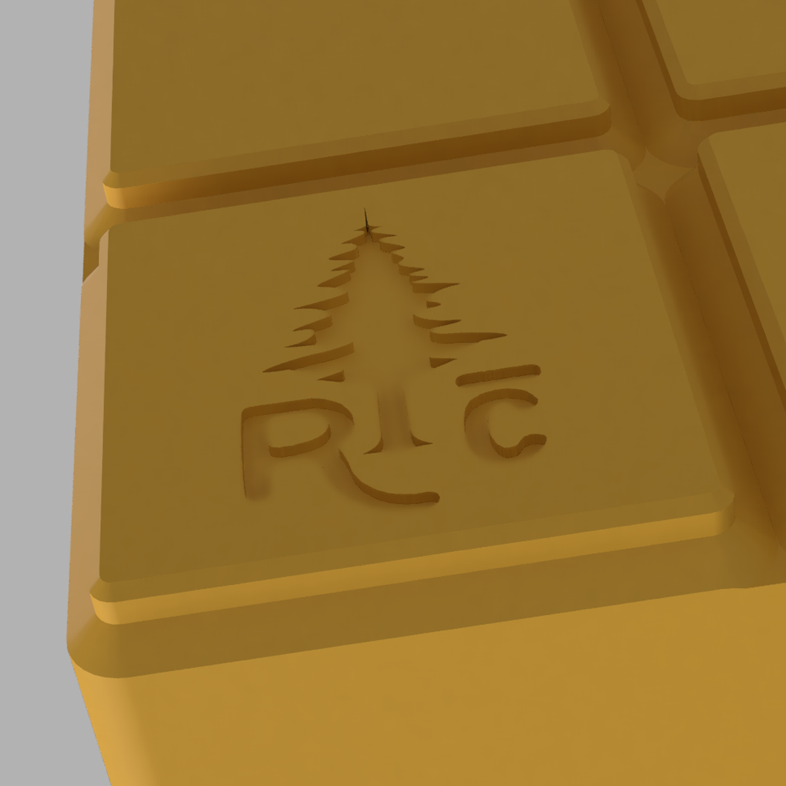

# GridfinityBatteryBinGenerator

A Fusion 360 add-in that generates parametric [Gridfinity](https://gridfinity.xyz/) battery
storage bins — pick a bin size and a battery type, and it builds the bin with the
maximum number of tip-down battery slots that fit.



Batteries store **tip down**. Every slot has a recess cut into its bottom so the
button (or a 9V's snap terminals) hangs free and the battery rests on its
shoulder — the weight never sits on the terminal. Slots are laid out to maximize
count: the generator tries a square grid and hex-offset packing in both
orientations and keeps whichever fits the most cells, centered in the bin.



Rectangular slots get the same treatment. This 2×3 holds eleven 9V cells: a 3×3
block plus two more turned 90° into the strip a uniform grid would have wasted.

## Features

- **One dialog** — battery type (AAA, AA, CR123, 9V, 18650) plus bin width × length in
  Gridfinity units. Everything else is prefilled and editable.
- **Real Gridfinity geometry** — base studs, walls, and stacking lip come from
  the geometry library of **Lev Mishin's**
  [GridfinityGenerator](https://github.com/Le0Michine/FusionGridfinityGenerator)
  **v1.4.3.0**, bundled here unmodified, so bins are identical to that plugin's
  output and compatible with standard baseplates and stacking.
- **Maximized layouts** — hex-offset packing for round cells (a 2×3 bin holds
  41 AAA or 25 AA with defaults; square wins where it packs more, as with
  18650), and rectangular grids for 9V that fill the leftover strip with a row
  turned 90° — switchable off for a uniform grid.
- **Auto height** — computes the minimum height that keeps the slots and tip
  recesses inside the bin, with at least 1 mm of solid floor under the deepest
  cut, so bins stay as short as possible.
- **Free or unit height** — *Constrain height to gridfinity units* (off by
  default) is the choice between the two. See
  [Bin height](#bin-height) for the trade-off.
- **Stackability check** — a live readout shows the vertical stack-up and warns
  if a stored battery would stand proud of the wall top and interfere with a
  bin stacked above.
- **Editable layout rules** — minimum slot-to-slot spacing (3 mm), slot-to-wall
  clearance (5 mm), and the fillet radius where the slot ledge meets the wall
  (3 mm) are all dialog inputs; tightening them squeezes in more batteries.
- **Branded** — the Redwood Craftworks logo is engraved into the corner
  gridfinity foot of every bin. Not an option and not a prompt; it is simply
  always there, recessed so the bin still sits flat.
- **Standard bin options** — stacking lip, lip notches, magnet cutouts, and
  screw holes pass straight through to the underlying library.

## Install

**Manual (from this repo):** copy the `GridfinityBatteryBinGenerator` folder (the one
containing `GridfinityBatteryBinGenerator.py`) to Fusion's add-ins folder:

| OS | Path |
|---|---|
| Windows | `%APPDATA%\Autodesk\Autodesk Fusion 360\API\AddIns\` |
| macOS | `~/Library/Application Support/Autodesk/Autodesk Fusion 360/API/AddIns/` |

Then in Fusion: **Utilities → ADD-INS → Add-Ins tab**, select
*GridfinityBatteryBinGenerator*, check *Run on Startup*, click **Run**. A
**Gridfinity Battery Bin** button appears under **Solid → Create**.

**MSI (Windows, all users):** grab the installer from
[Releases](../../releases). It installs the add-in machine-wide to
`C:\Program Files\Autodesk\ApplicationPlugins`, covering every user profile on
the computer, and finishes with a page confirming the install and reminding
you to restart Fusion. Don't combine it with a manual copy in `%APPDATA%` or
the command will appear twice.

## Usage

Pick a battery type — the slot dimensions, recess dimensions, ledge drop, and
battery length load from the defaults table below (all editable per run). Set
the bin footprint in Gridfinity units. The result box at the bottom shows the
battery count, the chosen layout, the vertical stack-up, and the stackability
margin before you commit. *Show preview* regenerates the model live as you
change inputs (slower on large bins); leave it off and just hit OK.

### Bin height

Gridfinity fixes the 42 mm footprint, not the height, so the 7 mm unit grid is
optional and the dialog offers both. Leave **Constrain height to gridfinity
units** off and the bin is exactly as tall as the slots need — an AA bin comes
out 59.6 mm instead of 63 mm, and CR123 saves a whole unit — but bins of
different battery types then finish at different heights, so a row of them on a
baseplate has a ragged top edge; turn it on and every bin lands on the same
7 mm ladder and a drawer of mixed bins looks deliberate, at the cost of up to
7 mm of dead plastic and print time per bin. Stacking works either way: the lip
mates with the base above it regardless of how tall the bin is.

Off the unit grid, **Round height to layer** (0.2 mm by default) rounds the
computed height up to a whole number of print layers, so the top face lands on
a layer boundary instead of part way through one. Set it to 0 for the exact
computed height. Type your own height and the readout will tell you if it ends
mid-layer, but it won't override you.

### Logo



Every bin is engraved with the logo at
`GridfinityBatteryBinGenerator/commands/commandCreateBatteryBin/resources/logo.svg`,
31 mm across and 0.4 mm deep (two 0.2 mm layers) on the corner foot. There is
no dialog control for it — the size, depth, foot and orientation are constants
at the top of `lib/batteryUtils/logoUtils.py`, and the artwork is changed by
replacing that SVG.

To swap the artwork, put your SVG at `docs/logo-source.svg` and run:

```
python3 tools/bake_logo.py docs/logo-source.svg \
  GridfinityBatteryBinGenerator/commands/commandCreateBatteryBin/resources/logo.svg
```

The tool mirrors the artwork, rotates it 90°, and writes the result into the
path data rather than a transform attribute — Fusion imports SVG geometry as
fixed curves and clips to the viewBox, so a transform on a `<g>` is how a
rotated logo silently becomes no logo at all. It also drops zero-length
segments (Adobe exports are full of them; this one had 26) and snaps every
contour shut on its start point. Both would otherwise stop Fusion forming a
profile, and a region with no profile is a region that does not get engraved.
Lettering must be **converted to outlines** — Fusion ignores `<text>` entirely.

**Draw the letters as solid shapes, not outlines, and size them generously.**
The engrave is a hole in the first two layers, and the first layer is the
squished one, so a groove much under 0.5 mm closes up and the letter is lost.
A foot offers a 35.1 mm flat square and `maxLogoWidth` caps the logo at 31.1 mm
with a 2 mm margin clear of the bottom chamfer, so there is not much room to
fix thin artwork by scaling it. The bundled logo's narrowest strokes are
0.51 mm at 31 mm. If a line still drops out on your printer, reducing the
first-layer line width to about 0.3 mm is the most effective remedy.

The bundled artwork is generated; the untouched original is kept at
`docs/logo-source.svg`. Do not hand-edit `logo.svg` — re-run the tool.

Nested regions are handled by nesting depth, so counters in lettering stay
open and islands inside those counters still engrave.

Default dimensions (mm), from a well-tested set of printed bins:

| | AAA | AA | CR123 | 9V | 18650 |
|---|---|---|---|---|---|
| Slot Ø (or L×W) | 11 | 14.75 | 17 | 27.4 × 17.5 | 19 |
| Slot depth | 30 | 36 | 20 | 34 | 51 |
| Tip recess Ø (or L×W) | 4 | 6 | 7 | 21 × 9 | 10 |
| Tip recess depth | 2.5 | 2.5 | 2.5 | 4 | 2.5 |
| Ledge drop from wall top | 15 | 15 | 15 | 15 | 15 |
| Battery length (max nominal) | 44.5 | 50.5 | 34.5 | 48.5 | 65.2 |
| Auto height, unit grid | 8 u (56) | 9 u (63) | 7 u (49) | 9 u (63) | 11 u (77) |
| Auto height, free (mm) | 53.6 | 59.6 | 43.6 | 59.0 | 74.6 |

To change the defaults permanently, edit
`GridfinityBatteryBinGenerator/lib/batteryUtils/batteryDefs.py` — adding a new battery
type is a single new entry in the same table.

## How the layout works

The minimum pitch between slot centers is *slot diameter + spacing*. For round
cells, hex-offset rows sit √3/2 × pitch apart (alternate rows shifted half a
pitch), which packs meaningfully more cells than a square grid once the bin is
a few slots wide — every neighbor, including diagonals, stays exactly one pitch
apart, so the 3 mm minimum wall between slots holds everywhere. The generator
compares square, hex-along-X, and hex-along-Y and keeps the winner. The 5 mm
slot-to-wall clearance leaves room for the 3 mm fillet that strengthens the
junction between the slot ledge and the wall above it.

9V slots are rectangles, and a grid of them usually leaves a strip too narrow
for another column but wide enough for a row turned 90°. The generator tries
both orientations as the main block and fills the leftover strip with the other
one, which is worth three extra cells on a 3×3 bin (18 against 15). Uncheck
**Allow mixed slot orientations** under *Layout rules* and every slot faces the
same way instead — fewer batteries (a 2×3 holds 10 rather than 11, a 3×3 holds
15), but a uniform bin you can load without looking. The readout tells you how
many cells the tidier layout costs. Some sizes cost nothing: a 4×4 packs 35
either way.

Depth is bounded from below as well: the deepest cut — slot plus tip recess —
must stop at least 1 mm above the underside of the bin body. The feet cover
only part of that face, and the slot grid is centered on the bin rather than
aligned to the 42 mm foot pitch, so a recess that dips below the body would
break clean through wherever it happened to land over the gap between two feet.

## Known issues

- **The engraved logo can print unclearly on the base.** It is a deboss, which
  the slicer prints as holes in the first two layers — and the first layer is
  the squished one, so a groove much under 0.5 mm closes up and the letter is
  lost. 1.1.0 redraws the artwork with solid letterforms at 31 mm, taking the
  narrowest strokes from 0.41 mm to 0.51 mm, but that has been measured rather
  than confirmed on a print. If letters still run together on your printer,
  drop the **first-layer line width to about 0.3 mm** — at the stock 0.42 mm
  the slicer cannot route a perimeter around a 0.5 mm hole and bridges it
  instead. Deepening `LOGO_DEPTH` to 0.6 mm (three layers) is the next lever.
- **Battery dimensions are from measured samples, not a standard.** Cells vary
  by brand, and protected or button-top 18650s run 67–70 mm against the 65.2 mm
  default. Check the fit readout and adjust slot depth and battery length in
  the dialog before committing to a long print.
- **No C, D, AAAA or coin cells yet.** Adding one is a single entry in
  `lib/batteryUtils/batteryDefs.py` if you have calipers.
- **The gridfinity library is vendored, so it does not track upstream.** Bin
  geometry is frozen at FusionGridfinityGenerator v1.4.3.0; updates to that
  plugin do not reach this add-in until the bundled copy is refreshed.
- **Preview is slow on large bins.** *Show preview* rebuilds the whole model on
  every input change; on a 4×5 bin that is a few seconds per keystroke. Leave
  it off and read the text readout, which is instant.
- **Fusion must be restarted after installing.** The add-in is registered at
  startup, so it will not appear in Solid → Create until Fusion is relaunched.
- **The MSI is Windows-only.** On macOS, copy the add-in folder by hand — see
  Install above.

## Verifying the download

Every release lists the SHA-256 of the MSI. The installer is also
Authenticode-signed as **Bryan Gravely**; check both:

```powershell
Get-FileHash .\GridfinityBatteryBinGenerator-1.1.0-x64.msi -Algorithm SHA256
Get-AuthenticodeSignature .\GridfinityBatteryBinGenerator-1.1.0-x64.msi | Format-List
```

Hash the `.msi` itself, and compare case-insensitively — `Get-FileHash` prints
uppercase, `sha256sum` lowercase.

| Version | SHA-256 of the signed MSI |
|---|---|
| 1.1.0 | `B105E836D8D14EF6572115A6A4302470325CAAA4FF7249F0AB2564AD7D0369B4` |

## Development

The layout math and dialog logic are plain Python with no Fusion dependency
and run anywhere:

```
python3 GridfinityBatteryBinGenerator/tests/test_layout.py      # packing + height math
python3 GridfinityBatteryBinGenerator/tests/test_logo.py        # logo placement, nesting, SVG rewriting
python3 GridfinityBatteryBinGenerator/tests/test_entry_sim.py   # dialog logic against a stubbed Fusion API
python3 GridfinityBatteryBinGenerator/tests/test_packaging.py   # version/publisher consistency across manifest + installer
```

`installer/` holds the Windows MSI sources: `make_wxs.py` regenerates the WiX
source from the tree, `License.rtf` is the licence page shown during install,
and `build.ps1` documents the build (the WiX **UI extension** is required, or
the build fails on `WixUI_Minimal`). `PackageContents.xml` is used for the
Autodesk App Store `.bundle` submission.

## License and credits

Licensed **CC BY-NC-SA 4.0** (free, non-commercial, share-alike) — see
[LICENSE](LICENSE).

- Gridfinity bin geometry: bundled unmodified from
  [FusionGridfinityGenerator](https://github.com/Le0Michine/FusionGridfinityGenerator)
  **v1.4.3.0** by **Lev Mishin** (Le0Michine), CC BY-NC-SA 4.0 (see
  [ATTRIBUTION](GridfinityBatteryBinGenerator/ATTRIBUTION.md)). Bins built here
  are that plugin's geometry; the credit for how a Gridfinity bin is shaped in
  Fusion belongs to him.
- The [Gridfinity](https://gridfinity.xyz/) system is by **Zack Freedman**,
  CC BY-NC-SA 4.0.
- Battery slot layout engine and the Battery bin command are original to this
  project.

Not affiliated with Autodesk. Fusion and Fusion 360 are trademarks of Autodesk, Inc.
